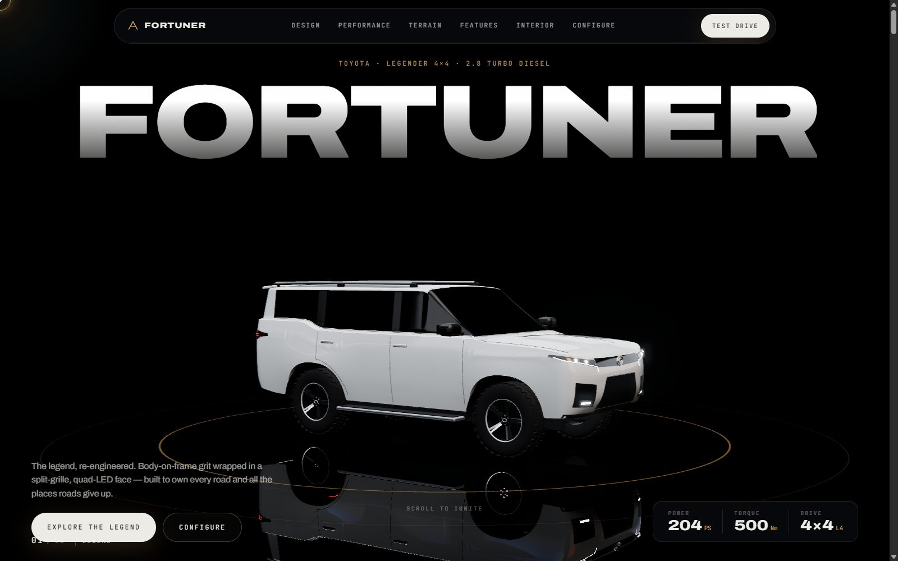
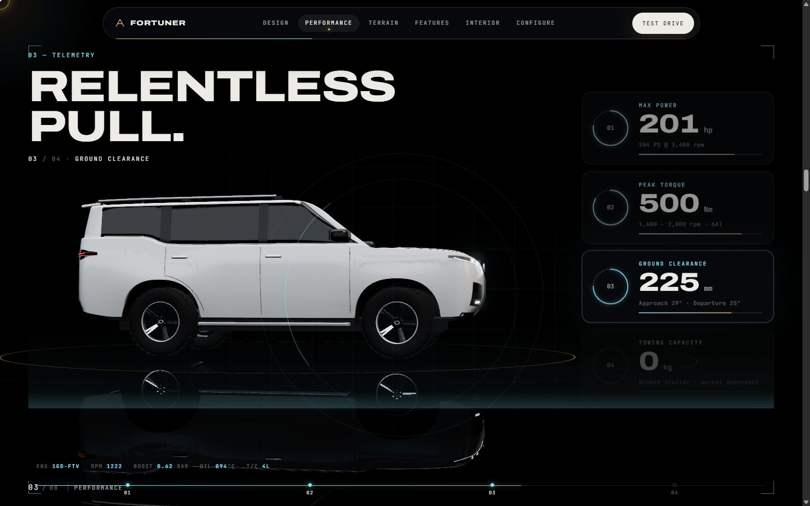
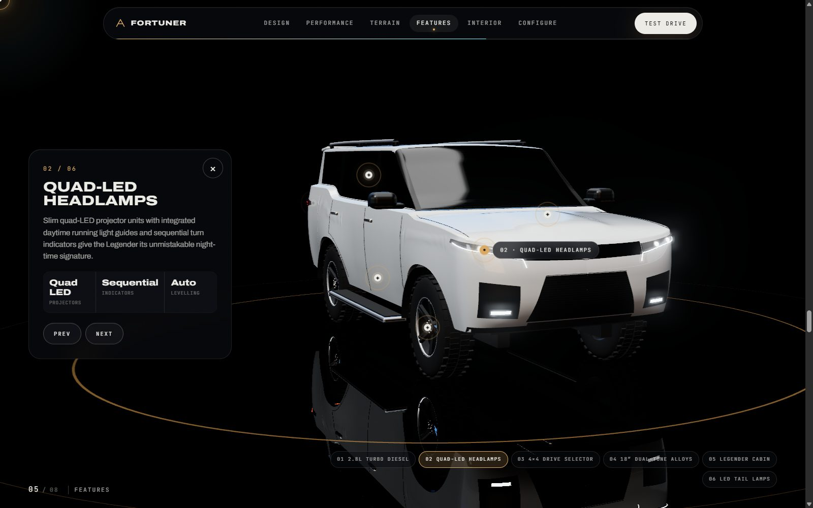
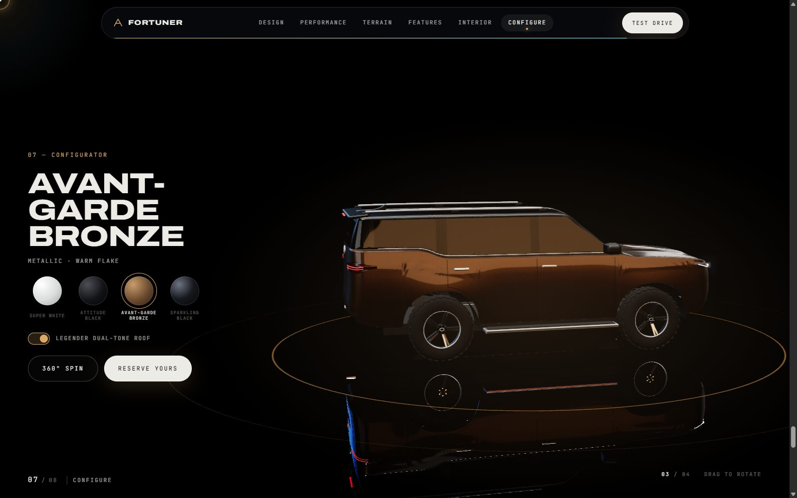

# Fortuner Legender: Cinematic 3D Showcase

A scroll-driven, Apple-style 3D product website for the Toyota Fortuner Legender. The car is a real
3D model rendered live in the browser with WebGL, not a video: spin it, repaint it, and fly the
camera around it in real time.

[](https://drive.google.com/file/d/1eHyH2H1sXhVdfwnWMORMa40Zj8odAq7G/view?usp=drive_link)


**🎬 Demo video:** [Watch on Google Drive](https://drive.google.com/file/d/1eHyH2H1sXhVdfwnWMORMa40Zj8odAq7G/view?usp=drive_link)



| Telemetry HUD | Interactive 3D hotspots | Live paint configurator |
|---|---|---|
|  |  |  |

## Highlights

- **Real-time 3D car.** A procedural Fortuner Legender built at its true dimensions (4,795 × 1,855 ×
  1,835 mm), with a clearcoat paint shader, quad-LED lights, a mirror floor and bloom.
- **Scroll-driven camera.** It orbits and cuts between shots as you scroll, Apple-style.
- **Telemetry HUD.** Animated counters and ring gauges for power, torque, ground clearance and towing.
- **Interactive hotspots.** Click a part of the car and the camera flies in.
- **Live configurator.** Four factory finishes applied with a glowing paint sweep, plus the Legender
  dual-tone roof.
- **Details.** A glowing custom cursor, magnetic buttons, glassmorphic navigation and a smooth-scroll
  engine.
- **Built for smoothness.** It renders on demand at full HD, adapts to the GPU, and never redraws
  when nothing moves.

## Tech stack

| Area | Tools |
|---|---|
| 3D rendering | Three.js (WebGL 2), custom shaders, EffectComposer bloom |
| Animation | GSAP 3 + ScrollTrigger |
| Smooth scroll | Lenis |
| Markup and styles | HTML5, modular CSS (no framework) |
| Image-sequence pipeline | FFmpeg + Python (`tools/extract_frames.py`) |

---

It works right away, with no build step. Every scroll sequence has a live fallback: a real-time 3D
orbit, or a procedural motion-graphic. Drop in your AI-generated footage and each section switches to
your frames automatically.

| Section | What it does |
|---|---|
| **01 Hero** | The car drives into frame with its wheels rolling and headlamps flickering on. The wordmark reveals letter by letter, then parallaxes out on scroll. |
| **02 Design** | 420vh sticky, scroll-scrubbed image sequence (*hero orbit*). Fallback: live 360° WebGL camera orbit. |
| **03 Performance** | Telemetry HUD over four scroll phases. Each phase fires an animated counter and ring gauge (power, torque, ground clearance, towing) and moves the 3D camera to a new shot. Parallax HUD layers and live jittering readouts. |
| **04 Terrain** | Scrubbed *off-road* sequence. Fallback: procedural golden-hour canyon with parallax ridges and a dust plume. |
| **05 Features** | Clickable 3D hotspots projected from car space. Selecting one flies the camera in and opens a glass detail panel. Drag to rotate. |
| **06 Interior** | Scrubbed *cockpit fly-through*. Fallback: grille → light tunnel → ambient-lit dash with sweeping gauges. |
| **07 Configure** | Four finishes applied with a shader paint sweep that wipes nose to tail. Legender dual-tone roof, 360° spin, drag and idle auto-rotate. |
| **08 Specs** | Spec grid and CTA. |

Also included: a glowing custom cursor, magnetic buttons, a glass nav with scroll progress, a chapter
indicator, a film-grain overlay, a loader with weighted progress, and reduced-motion support.

---

## Quick start: run it locally

ES modules and image loading need a real HTTP server, so opening `index.html` from disk (`file://`)
**won't work**. Pick one:

```bash
# Python 3 (preinstalled on most machines)
cd fortuner-showcase
python -m http.server 8080
```

```bash
# Node.js
npx serve fortuner-showcase -l 8080
```

Then open **http://localhost:8080**. The VS Code "Live Server" extension works too.

Libraries load from the jsDelivr CDN (three@0.169, gsap@3.13, lenis@1.1), so the first load needs
an internet connection.

> **Console 404s are expected** until you add assets. On load the site probes for
> `frame_0001.webp` in each sequence folder and for `assets/models/fortuner.glb`. A 404 simply
> means "use the fallback".

---

## Step 1: Generate source footage with AI

Copy-ready prompts for Veo, Kling and Runway are in **[docs/VIDEO_PROMPTS.md](docs/VIDEO_PROMPTS.md)**:

1. **Hero 360° orbital turnaround:** studio, reflective black floor, seamless loop
2. **Off-road tracking shot:** front three-quarter, canyon or dunes, dust and articulation
3. **Cockpit fly-through:** grille → through the slats → ambient-lit dashboard

The file also covers negative prompts and how to keep the car consistent across shots.

## Step 2: Split the videos into image sequences

### Option A: the included script (recommended)

Requires `ffmpeg` and `ffprobe` on your PATH. Install with `winget install Gyan.FFmpeg`,
`brew install ffmpeg` or `sudo apt install ffmpeg`.

```bash
python tools/extract_frames.py path/to/hero.mp4    assets/sequences/hero
```

```bash
python tools/extract_frames.py path/to/offroad.mp4 assets/sequences/offroad
```

```bash
python tools/extract_frames.py path/to/cockpit.mp4 assets/sequences/cockpit
```

Each run writes:

```
assets/sequences/hero/
├── frame_0001.webp … frame_0200.webp   1920px wide, WebP q78
├── manifest.json                       frameCount/size (overrides config)
└── mobile/
    ├── frame_0001.webp … frame_0200.webp   960px wide, used on phones
    └── manifest.json
```

Useful flags: `--frames 200`, `--width 1920`, `--quality 78`, `--mobile-width 960` (0 skips the
mobile set), `--start 0.5 --duration 7` to trim.

### Option B: raw FFmpeg

For an 8-second clip, 200 frames means 25 fps. Replace `25` with `200 / clip_seconds`.

```bash
mkdir -p assets/sequences/hero
```

```bash
ffmpeg -i hero.mp4 -vf "fps=25,scale=1920:-2:flags=lanczos" -frames:v 200 -an -c:v libwebp -quality 78 -compression_level 6 -preset picture assets/sequences/hero/frame_%04d.webp
```

On Windows PowerShell the command is the same. Create the folder first with
`New-Item -ItemType Directory -Force assets/sequences/hero`.

If you use raw FFmpeg and end up with a count other than 200, update `frameCount` in `js/config.js`,
or write a `manifest.json` containing `{ "frameCount": N }`.

### Where the frames go

| Video | Folder | Section |
|---|---|---|
| Hero orbit | `assets/sequences/hero/` | 02 Design |
| Off-road | `assets/sequences/offroad/` | 04 Terrain |
| Cockpit | `assets/sequences/cockpit/` | 06 Interior |

Reload the page. The "procedural preview" badge disappears and the canvas scrubs your footage.

**Budget:** 200 frames at 1920px and q78 usually come to 8–20 MB per sequence (WebP). Phones load
the 960px `mobile/` set, which is roughly a quarter of that.

---

## How the scrub engine works (`js/core/frame-sequence.js`)

- **Coarse-to-fine preloading.** Frames are requested in priority order: first and last, then every
  64th, 32nd … every frame. Scrubbing works after about 10 images, and detail fills in while you read.
  Loading runs six requests at a time.
- **Decoded before display.** Each image is `decode()`d off the main thread before it's used, so
  drawing never stalls on decode.
- **Nearest-frame fallback.** If the exact frame isn't loaded yet, the closest loaded one is drawn,
  so there are no blank flashes.
- **Inertial smoothing.** Scroll progress sets a target frame and the canvas eases toward it in one
  rAF loop. Combined with Lenis this gives butter-smooth scrubbing even on notchy mouse wheels.
- **Cover-fit canvas.** Frames are drawn with `object-fit: cover` behaviour at the device pixel ratio
  (capped at 2, or 1.5 on mobile). Redraws only happen when the frame changes.
- **Sticky, not pinned.** Sections use CSS `position: sticky` with a tall container. ScrollTrigger
  only reads progress (`top top` → `bottom bottom`), which avoids pin-spacer jank.
- **First sequence gated.** The first sequence's first 24 priority frames are loaded behind the
  loader. The rest stream in page order after the intro.

---

## Customising

Everything tweakable is in **`js/config.js`**:

- `SEQUENCES`: folder paths, frame counts, naming, fallback type
- `SHOTS`: camera presets (azimuth, elevation, distance, target, screen shift/lift) for every section
- `FINISHES`: paint colour, metalness, roughness, flake amount, swatch gradient, section tint
- `TELEMETRY`: counter values, units, gauge max, captions
- `HOTSPOTS`: 3D anchor positions (car space: nose = +X, metres), copy, stats, fly-to camera shot
- `SPECS`, `DEALER_URL`, `SHOW_DEV_BADGES` (set to `false` once your frames are in)

### The built-in 3D Fortuner

With no GLB supplied, `js/three/fortuner-procedural.js` builds a Legender at its real dimensions:
4,795 × 1,855 × 1,835 mm, 2,745 mm wheelbase.

- **Lofted body.** The body is a swept surface rather than primitives: cross-sections run along the
  car, and the nose and tail are superellipse-rounded. It has a shoulder ledge with glass tumblehome,
  flared haunches, a shoulder crease, a hood power bulge, and the Fortuner's kicked-up rear-quarter
  window line.
- **Legender face.** Slim quad-LED headlamps with projectors, a "waterfall" LED line guide and
  sequential indicators, joined by a piano-black upper grille. Below: a honeycomb trapezoid lower
  grille, fog-lamp pockets and a satin skid plate.
- **Rear and sides.** Split LED tail lamps with a chrome garnish, black A/B/C pillars, body-colour
  (or dual-tone black) D-pillar and roof, a chrome window line, door shut lines, side steps and roof
  rails.
- **Wheels.** Dual-tone machined 18″ twin-spoke alloys on all-terrain tyres.
- **Surface-conforming details.** Every detail is built as a patch on the analytic body surface, so
  it wraps the curved corners. Tweak shapes via the profile curves at the top of the file.

For a photo-real scan or artist model, use a GLB instead:

### Using a real 3D model

Drop a GLB at **`assets/models/fortuner.glb`** and it replaces the procedural model automatically.
The loader supports Draco compression.

- It's normalised to 4.8 m long, centred, and placed on the floor.
- Meshes whose material or object name matches `MODEL.paintMaterial` (default
  `/paint|body|carpaint|exterior/i`) get the configurator paint with the sweep shader.
- If the nose doesn't point toward +X, set `MODEL.rotationY` (for example `Math.PI / 2`).
- Adjust `HOTSPOTS[].position` so the markers sit on your model's features.

Compress large models first:

```bash
npx @gltf-transform/cli optimize input.glb assets/models/fortuner.glb --compress draco --texture-compress webp
```

Aim for under 100k triangles and under 5 MB.

---

## Performance and accessibility

- **Render on demand.** The WebGL scene only redraws when something visible changes (camera, car,
  paint, lights). A still scene costs zero GPU time, and redraws are capped at 60 fps on 120 Hz screens.
- **Full quality whenever still.** The car always renders at full device resolution with 4× MSAA,
  bloom and full-res reflections. While the camera is moving, it measures real frame times. If the
  GPU drops below ~40 fps, moving frames use a lighter twin buffer (same effects, 0.85× pixels,
  upscaled), and the moment motion stops the frame is redrawn at full quality. It re-tests full
  quality every 10 s, so fast GPUs stay on the crisp path.
- **Bandwidth-lean post-processing.** MSAA is resolved once, right after the scene pass
  (`js/three/msaa-render-pass.js`), and bloom and tone mapping run on a plain HDR buffer, so the
  pixels are identical. The floor reflector skips its default 4× MSAA, which is invisible at its
  ~16% strength under the falloff.
- **Manual overrides** for tuning: `?bloom=0`, `?reflections=0`, `?maxDpr=1`, `?msaa=2`,
  `?motionScale=0.7`, `?motionBuffer=0` (combine with `&`).
- **One ticker.** GSAP's ticker drives Lenis, ScrollTrigger and the WebGL render loop.
- **WebGL pauses** while an opaque sequence section covers the screen, while the specs section is in
  view, and when the tab is hidden.
- **Fallback loops** only animate while their section is on screen (IntersectionObserver).
- **`prefers-reduced-motion`** disables smooth scrolling, the drive-in intro, blur transitions and
  counter tweens. Scrubbing stays under the user's control.
- **Keyboard:** hotspots and swatches are real buttons. Swatches form a radiogroup you can move
  through with the arrow keys. In Features, `Esc` closes the panel and `←`/`→` step through hotspots.
- **No WebGL?** The page still works: text, sequences and 2D fallbacks run over a static gradient.

## Project structure

```
fortuner-showcase/
├── index.html
├── css/
│   ├── base.css          tokens, reset, type
│   ├── layout.css        loader, stage, nav, chapter indicator
│   ├── components.css    cursor, buttons, hotspots, stat cards, swatches, toggle
│   └── sections.css      hero, cinema, telemetry, features, configurator, specs
├── js/
│   ├── main.js           boot sequence + scroll "director"
│   ├── config.js         ← edit me
│   ├── core/             frame-sequence engine, Lenis setup
│   ├── three/            stage, procedural model, paint shader, studio env, hotspots
│   ├── sections/         hero, cinema, telemetry, features, configurator, 2D fallbacks
│   └── ui/               cursor, magnetic, nav, loader, drag, split-text
├── assets/
│   ├── sequences/{hero,offroad,cockpit}/   ← drop frames here
│   └── models/                             ← optional fortuner.glb
├── tools/extract_frames.py
└── docs/VIDEO_PROMPTS.md
```

## Troubleshooting

| Symptom | Fix |
|---|---|
| Blank page, CORS or module errors | You opened the file directly. Serve it over HTTP (see Quick start). |
| Section still shows "Procedural preview" | Check that the path is exactly `assets/sequences/<name>/frame_0001.webp` (4-digit, 1-based). |
| Sequence ends early or repeats | The frame count doesn't match. Use the script's `manifest.json` or fix `frameCount`. |
| Scrub feels steppy | Use 150–240 frames, and keep the source motion at constant speed (no speed ramps). |
| Low FPS on laptops | Try `?reflections=0` or `?maxDpr=1` in the URL, then bake the winner into `detectQuality()` in `main.js`. |

---

*Unofficial concept project. Toyota, Fortuner and Legender are trademarks of Toyota Motor
Corporation. Specifications are indicative and vary by market. Edit them in `config.js`.*
